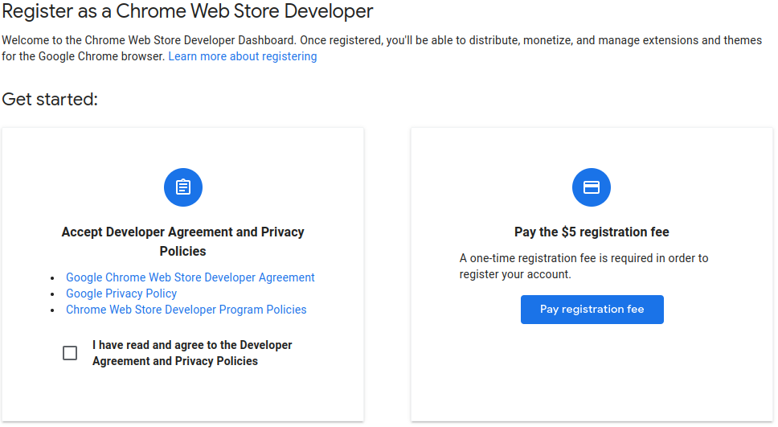

# Google-Results-Enhancer
### A Chrome extension to increase your productivity

This project is the result of a personal passion to increse productivity and re-imagine established practices.

## Why?
- Google search results are returned as truncated text, wasting about half of your screen's precious real-estate
- There is NO native way to utilise this blank space, leading to extended scrolling when you really dont have to
- This extension resolves this by adding 3 things:
1. A 2-column view of the results
2. A auto-hiding information side-panel
3. Numbering of the results so you never loose track
 

## See it in action
The following video shows the effect of the extension on the Google results for the query "koi":
 

 

## How?
A combination of CSS and Javascript is used to achieve the mentioned results.
 

## Why not Publish on the Chrome Web Store?
Unfortunately, publishing to the Chrome Web Store isn't free; and eventhough the fee is Justifiable, it isn't Affordable:
 

 

## Future
At present, there are no scheduled upgrades for the extension's functionality. However, open discussions are encouraged!
 

## Note on privacy
- Absolutely NO data is collected for ANY reason (telemetry-free :)
- Users are encouraged to dive into the (admittedly shallow) code
 
